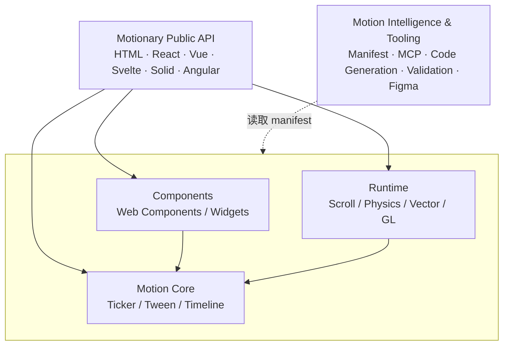

# Motionary 架构（11.0 → 13.0）

建议的**逻辑**架构，不表示目前必须拆分成独立 npm 包：`motionary`（及别名 `use-scroll-animate`）仍是一个包，各层通过子路径导出。



```
┌──────────────────────────────────────────────────────────────┐
│                    Motionary Public API                      │
│        HTML · React · Vue · Svelte · Solid · Angular         │
├────────────────────┬────────────────────┬────────────────────┤
│     Components     │    Motion Core     │      Runtime       │
│ Web Components /   │ Ticker / Tween /   │ Scroll / Physics / │
│ Widgets            │ Timeline           │ Vector / GL        │
├────────────────────┴────────────────────┴────────────────────┤
│              Motion Intelligence & Tooling                   │
│   Manifest · MCP · Code Generation · Validation · Figma      │
└──────────────────────────────────────────────────────────────┘
```

## 依赖规则（`test/architecture.test.ts` 强制）

只约束**值导入**（`import type` 在编译后消失，不计入）：

| 层 | 允许依赖 |
|---|---|
| Motion Core | 无（只依赖自身） |
| Runtime | Motion Core |
| Components | Motion Core（runtime 模块在运行时通过 `use()` 注册表查找，不直接导入） |
| Public API | Components、Motion Core、Runtime |
| Motion Intelligence & Tooling | 读取 Manifest（`components.json` / `dist/manifest.json`）；`src/` 内的 AI 层只依赖 Motion Core |

另外：`src/` 不得导入 `scripts/`、`bin/` 或 `figma-plugin/`。测试的例外列表只能减少不能增加；11.6 起为空：确定性解析器移入 Motion Core（`src/components/core/intent.ts`，纯函数），`<usa-motion-prompt>` 不再导入 Tooling 层，Tooling 入口 `motionary/tooling/ai` 只做再导出并提供可插拔 LLM provider（[ai-provider.md](./ai-provider.md)）。

## 现有目录 → 层

| 层 | 目录 / 文件 | 子路径 |
|---|---|---|
| Public API | `src/index.ts` 及根目录的 `core.ts`、`presets*.ts`、`parallax.ts`、`stagger.ts`、`element*.ts`、`types.ts`（HTML `data-*` API，原 use-scroll-animate）；`src/react.ts`、`vue.ts`、`svelte.ts`、`solid.ts`；`src/components/frameworks/*`（含 Angular）；`src/entries/*`（逐组件 / 逐特效入口）；`src/runtime/iife/*`（CDN `<script>` 入口） | `motionary`、`motionary/react` …、`motionary/angular`（11.5；旧 `motionary/angular`）、`motionary/widgets/<name>`、`motionary/effects/<name>`、`dist/runtime/*.iife.js` |
| Motion Core | `src/runtime/{index,registry,ticker,tween,ease,keyframes}.ts`；`src/components/core/*`（`createMotion()`；11.6 起含纯函数动效意图解析器 `intent.ts`） | `motionary/runtime`、`motionary/core` |
| Runtime | `src/runtime/*.ts` 的其余模块（scroll、smooth、text、drag-snap、physics、vector、lottie-*、gl、gltf-*、format-*、anim-image） | `motionary/runtime/<module>` |
| Components | `src/components/**`（除 `frameworks/`、`ai/`、`core/`） | `motionary/components/*` |
| Motion Intelligence & Tooling | `src/components/ai`；`bin/`（`motionary-mcp`、`usa-codemod-*`）；`scripts/`（manifest、文档、entries、体积预算、检查）；`figma-plugin/`；`showcase/catalog/*`（清单数据） | `motionary/tooling/ai`、`motionary/tooling/design`、`motionary/tooling/manifest.json`（11.5 别名；旧路径 13.0 删除）、`npx motionary doctor`、`npx motionary-mcp` |

## 路线图条目 → 层

| 版本 | 主题 | 层 |
|---|---|---|
| 11.0 | 稳定版、zip 解压限制、本架构与分层检查 | 全部 |
| 11.1 | 无副作用、可 tree-shake | Motion Core · Components |
| 11.2 | Source map 策略 | Tooling |
| 11.3 | CI 性能指标 | Tooling |
| 11.4 | Runtime 分级 basic / standard / advanced | Runtime |
| 11.5 | Public API 对齐（Angular、分层子路径别名） | Public API |
| 11.6 | AI 层可插拔 LLM provider | Tooling |
| 11.7–11.9 | 组件契约审计、对齐、12.0 预备 | Components |
| 12.0 | 组件统一契约 | Components · Public API |
| 12.1 | 跨端 3.0 | Public API |
| 12.2–12.5 | MCP 校验、Figma 导出、Playground、版本兼容 | Tooling |
| 13.0 | 发现 · 复制 · 运行；目录按四层整理完成 | Tooling · 全部 |

## 迁移原则

11.x 内只新增与别名：新子路径与旧路径并存（11.5 起见 [public-api.md](./public-api.md)）。旧路径**运行时不发出警告**（导入保持无副作用，11.1 的保证），弃用通过 TypeScript `@deprecated`、`npx motionary doctor` 扫描、`usa-codemod-12` 改写和文档完成；删除只在 12.0 / 13.0，并提供 `usa-codemod-12` / `usa-codemod-13`。
